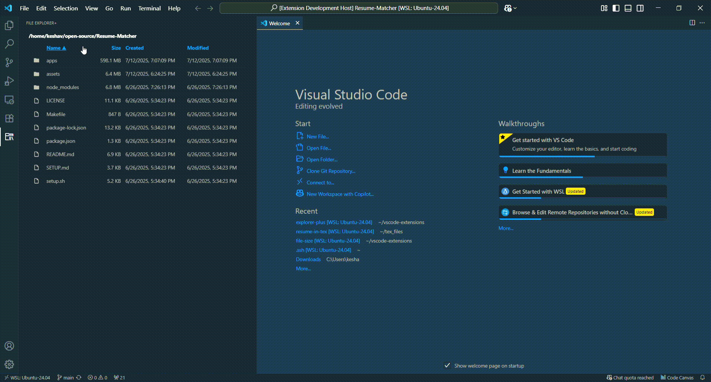

# Explorer Plus

Explorer Plus is a Visual Studio Code Extension Displays file sizes, created and modified dates as a seperate view.  

## Example

## Features

- **File Size:** See the size of each file in the explorer.
- **Date Created:** See the date created of every file and folder.
- **Folder Size:** See the total size of each folder.
- **Date Modified:** See the date Modified of every file and folder.

## Usage

- Open the Explorer plus view in VS Code.

## Upcoming Features

- Tree in view.
- Show hide columns.
- Search files and folders.
- Number of children inside each folder.

## Release Notes

### 0.0.1

- seperate view with sort.
- created and modified.

See [CHANGELOG.md](./CHANGELOG.md) for details.

## License

[MIT](./LICENSE)